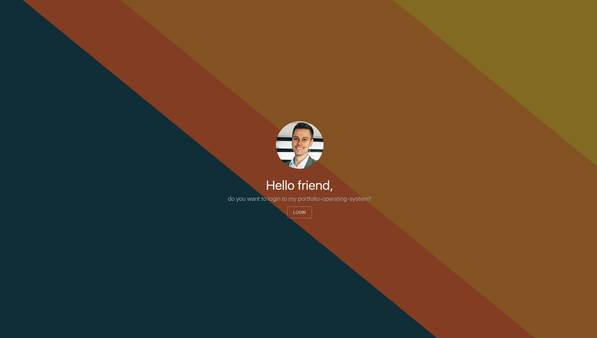
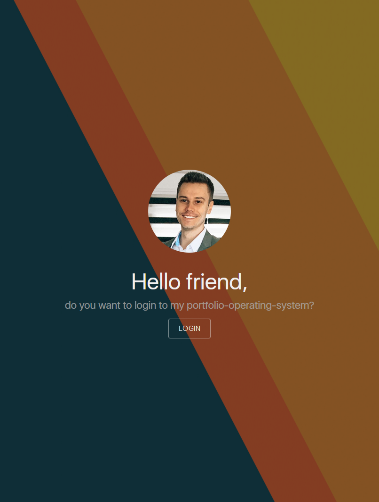
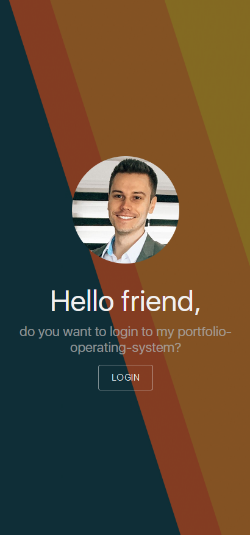
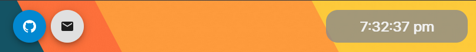
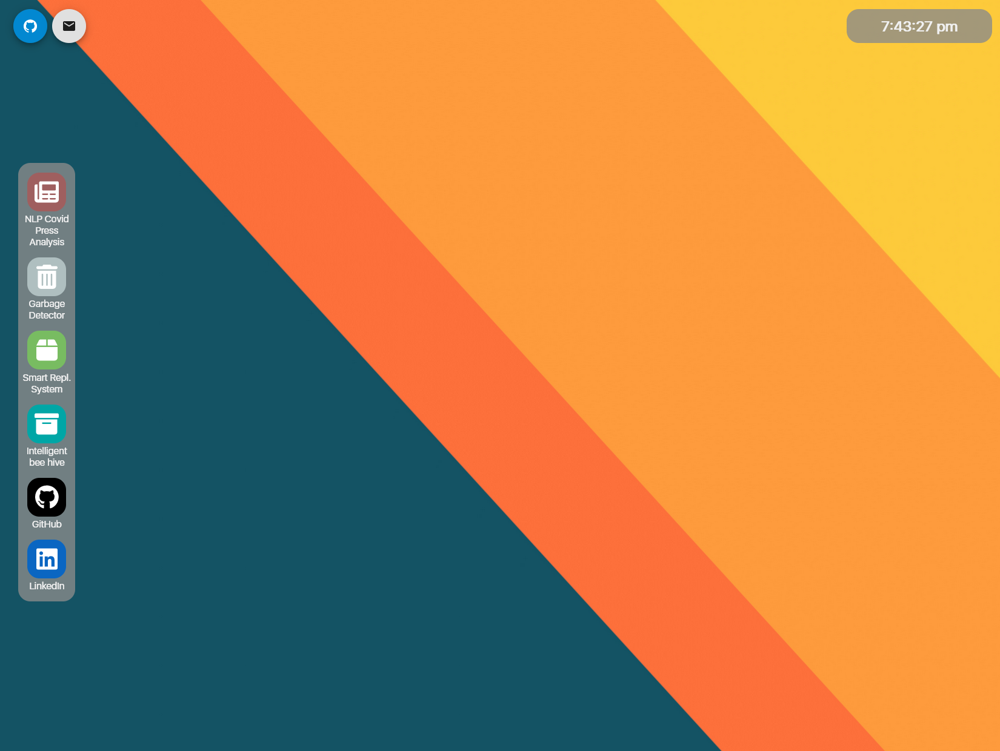
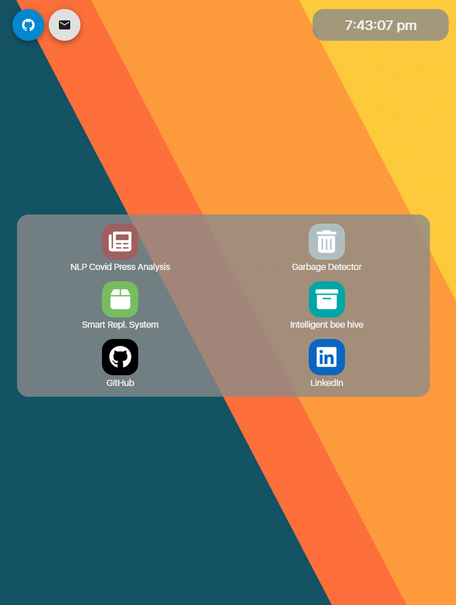
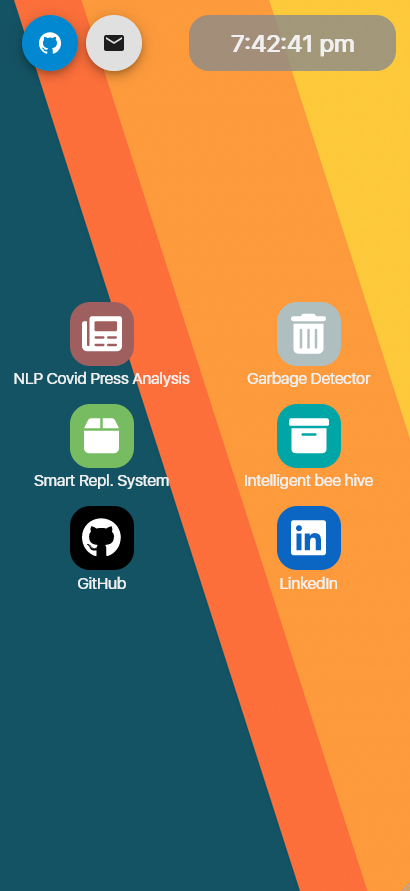
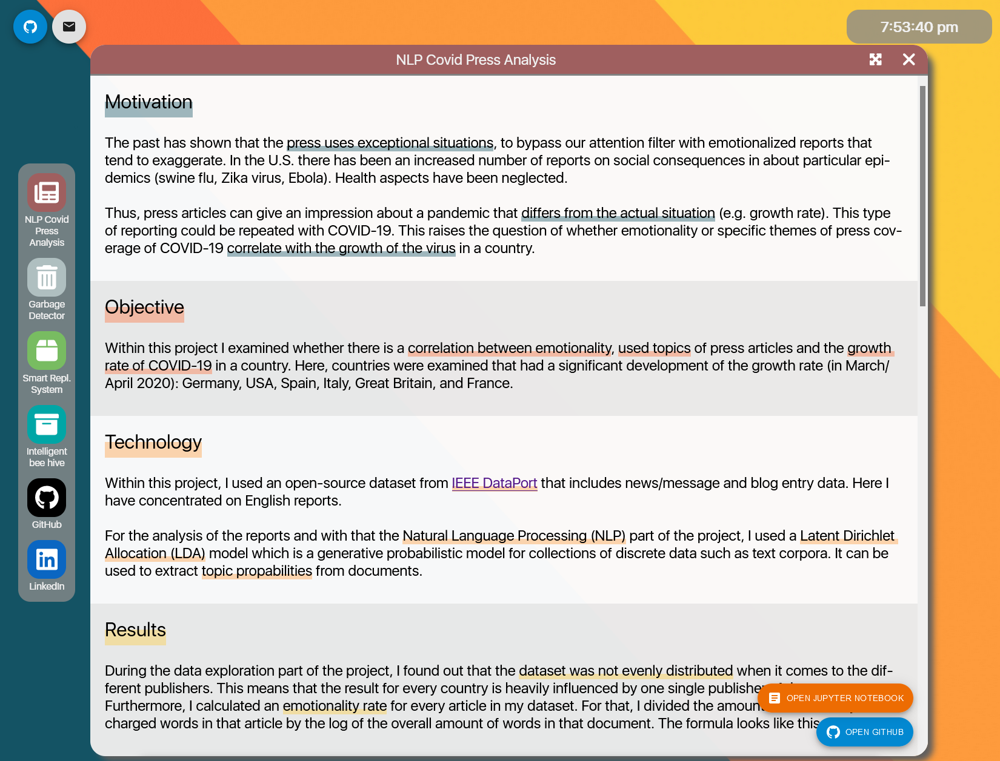
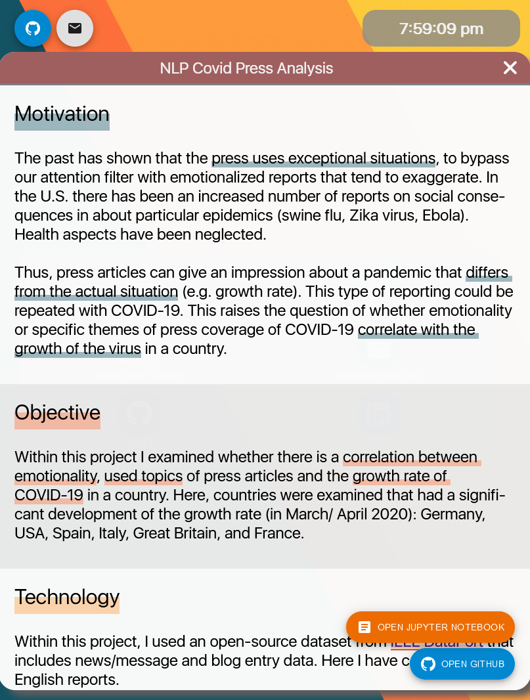
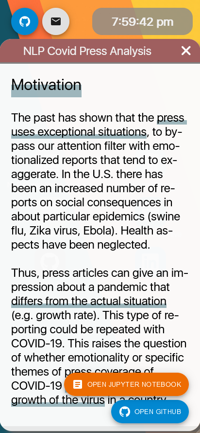

# Portfolio-Operating-System

I've published this repo with GitHub Pages: https://ajdev-1.github.io/aj-os/

Welcome to the source code of my portfolio operating system. I wanted to create a - let's say different - portfolio than most of the portfolios out there. I decided to design my portfolio like an operating system. The visitor should get the feeling of searching through my own laptop/ tablet or handy, exploring all the different projects I was involved in and als how to get in touch with me.

## How can you use this project?

For more information on which tools I used to create the app and how to run it within your local environment, check out the [./src](./src/README.md) folder. Feel free to download the project and use it as a starting point for your very own portfolio operating system.
If you are using this project as a starting point - feel free to get in touch with me and tell me what you've built. I'm highly interested in what you can built on top of this. 😊

## Components

This section describes all components that make up the OS page. Furthermore, it shows how the components look on different devices.

### 🔑 Login Widget
The [LoginWidget](./src/components/LoginWidget/LoginWidget.jsx) is used as the entry point for every new user. After clicking on the login button, the user gets redirected to the main [OperatingSystemPage](./src/components/OperatingSystemPage/OperatingSystemPage.jsx). Initially I wanted to add a input field which required a password (to make it feel like a real OS). The user would be able to type anything into that input field and then proceed. However, since most of my friends already had the feeling to leave the page when seeing a required password, I decided to use a single button...😃

| Desktop     | Tablet      | Handy       |
| ----------- | ----------- | ----------- |
|  |  |   |

### 🕐 Status Bar
The [StatusBar](./src/components/StatusBar/StatusBar.jsx) shows the current time as well as links to this repository (the OS source code) and a link to my mail address.

| Desktop     | Tablet      | Handy       |
| ----------- | ----------- | ----------- |
|  |  |   |

### 💻 Operating System Page and the Dock
The [OperatingSystemPage](./src/components/OperatingSystemPage/OperatingSystemPage.jsx) is the wrapper of the whole main view. It contains the [StatusBar](./src/components/StatusBar/StatusBar.jsx) and the [Dock](./src/components/Dock/Dock.jsx) which itself spawns [AppInstance(s)](./src/components/AppInstance/AppInstance.jsx). The user is able to explore all the different apps that are shown within the dock from this view.

The [Dock](./src/components/Dock/Dock.jsx) holds all apps that describe projects or touchpoints for the OS owner. Furthermore, it responds to different screen sizes. For desktop screens it attaches itself to the left side of the screen. However, for tablets it switch to a full width view, which is usual for tablets and their OS's (not sure if the grey background here makes sense in comparison to the handy screen - let me know what you think if you are using this repo 😊). Last but not least for handy and small screens if stays in full width mode and removes the grey background.

| Desktop     | Tablet      | Handy       |
| ----------- | ----------- | ----------- |
|  |  |   |

### 🔲 App Instance and App Window
Now, the content of the page resides in the [AppInstance(s)](./src/components/AppInstance/AppInstance.jsx). When the user clicks on an app within the dock, an AppInstance gets instantiated from the AppInstance class and finally shown on the page. By itself an AppInstance only shows an empty window. The scrollable content of the AppInstance comes from the [AppWindow](./src/components/AppWindow/AppWindow.jsx) component. While it is possible to move and resize the AppInstances on desktop screens, for tablet and handy screen they are in full width mode which means that the user needs to close them in order to open another app. On desktop screens the user can open multiple windows.

| Desktop     | Tablet      | Handy       |
| ----------- | ----------- | ----------- |
|  |  |   |

## 📝 To-Do's

- [ ] Routing for the login widget as well as the operating system page.
- [ ] Keep hiding the login widget on a refresh as soon as the user logged in once.
- [ ] Maybe add a "Me"-app?

## 👾 Known Bugs - Need to fix...

- [ ] When maximizing/ minimizing a window, the scrollable content does not adapt to the new window size. Need to adjust the window height when the user clicked on the maximize/ minimize button.
